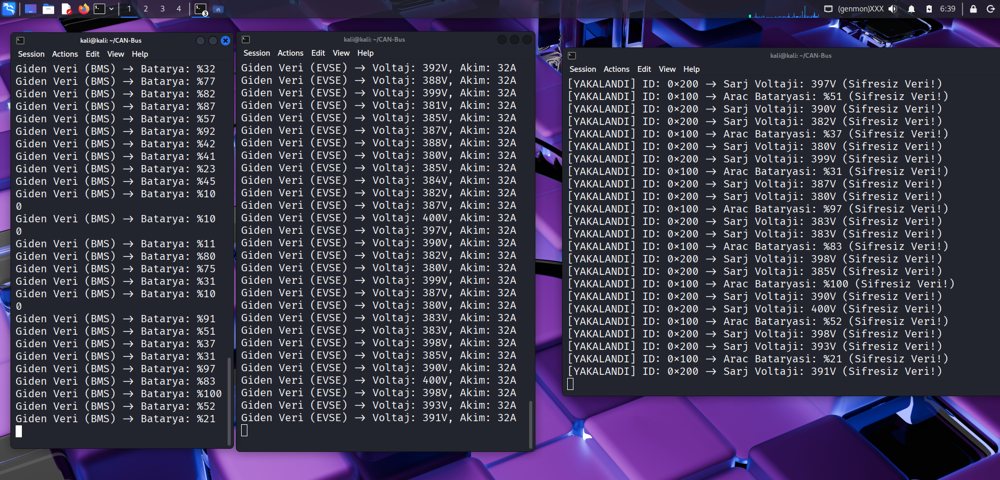

# ⚡ EV-Charging-Security  
### Anomaly Detection and Security Analysis for Electric Vehicle Charging Systems  

---

## 🧭 Proje Özeti  
Bu çalışma, **elektrikli araç şarj istasyonlarında (EVSE)** kullanılan iletişim protokolleri ve güvenlik standartlarının analiz edilerek **anomali tespiti ve güvenlik zafiyetlerinin belirlenmesini** amaçlamaktadır.  
Araştırma süreci, uluslararası standartlar (OCPP, ISO/IEC 15118, IEC 61851) ve güvenlik çerçeveleri (ISO/IEC 27001, NIST SP 800-53, GDPR) üzerine odaklanmıştır.

Proje çıktıları; akademik makalelerin analiziyle oluşturulan **anomali tespit tablosu** ve **SWOT analizi** sonuçlarını içermektedir.

---

## 🎯 Amaç  
Elektrikli araç altyapısı büyüdükçe, şarj istasyonları potansiyel siber saldırı hedefleri haline gelmektedir.  
Bu nedenle proje, aşağıdaki hedefleri gerçekleştirmek üzere tasarlandı:

- 🔍 EVSE iletişim protokollerindeki güvenlik açıklarını analiz etmek,  
- ⚙️ Mevcut güvenlik standartlarına göre zafiyetleri sınıflandırmak,  
- 🧠 Anomali tespitine yönelik makine öğrenimi yaklaşımlarını değerlendirmek,  
- 📊 Elde edilen bulguları SWOT analiziyle stratejik olarak yorumlamak.

---

## 🧩 Kullanılan Teknolojiler ve Kaynaklar  

| Araç / Kaynak | Açıklama |
|----------------|----------|
| 🧠 **ResearchRabbit** | Akademik makaleleri keşfetmek ve ilişkisel bağlantılarını analiz etmek için kullanıldı. |
| 🤖 **Google NotebookLM** | İngilizce makaleler yüklenerek Türkçe tablo ve SWOT analizi üretildi. |
---

## 📚 İncelenen Standartlar ve Protokoller  
- 🔌 **OCPP (Open Charge Point Protocol)**  
- ⚡ **ISO/IEC 15118**  
- ⚙️ **IEC 61851**  
- 🔒 **ISO/IEC 27001**  
- 🧱 **NIST SP 800-53**  
- 🧾 **GDPR (General Data Protection Regulation)**  
- 🧠 **EVSE / IoT Sistem Güvenliği İlkeleri**
- 🚗 **CAN-BUS (Controller Area Network)** - Elektrikli araç içi iletişim protokolü

---

## 🚗 CAN-BUS Protokolü ve Güvenlik Analizi

### CAN-BUS Nedir?

**CAN-BUS (Controller Area Network)**, otomotiv endüstrisinde yaygın olarak kullanılan bir seri iletişim protokolüdür. Elektrikli araçlarda, araç içindeki farklı elektronik kontrol üniteleri (ECU) arasında veri alışverişi yapmak için kullanılır. Örneğin:
- Batarya yönetim sistemi (BMS) ile şarj kontrol ünitesi arasındaki iletişim
- Motor kontrol ünitesi ile güç elektroniği arasındaki veri aktarımı
- Araç içi sensör verilerinin paylaşımı

CAN-BUS, **broadcast** (yayın) tabanlı bir protokoldür - ağdaki tüm cihazlar gönderilen mesajları görebilir. Bu özellik, gerçek zamanlılık ve güvenilirlik sağlar ancak güvenlik açısından kritik bir zafiyet oluşturur.

### 🔓 Şifreleme Eksikliğinin Sebepleri

CAN-BUS protokolünde şifreleme eksikliğinin temel sebepleri şunlardır:

1. **Tarihsel Tasarım**: CAN-BUS 1980'lerde tasarlandığında, siber güvenlik tehditleri bugünkü kadar yaygın değildi. Protokol, **gerçek zamanlılık** ve **güvenilirlik** üzerine odaklanmıştır.

2. **Performans Kısıtlamaları**: Şifreleme işlemleri, mesaj gönderim süresini artırır. Otomotiv sistemlerinde milisaniye düzeyinde gecikmeler kritik olabilir (örneğin fren sistemi, hava yastığı kontrolü).

3. **Standart Eksikliği**: CAN-BUS standardı (ISO 11898) şifreleme mekanizması içermez. Her üretici kendi güvenlik çözümünü geliştirmek zorundadır.

4. **Maliyet Faktörü**: Şifreleme donanımı ve yazılımı ek maliyet getirir. Özellikle düşük maliyetli araçlarda bu ek yük kabul edilmeyebilir.

5. **Uyumluluk**: Mevcut CAN-BUS altyapısına şifreleme eklemek, geriye dönük uyumluluk sorunları yaratabilir.

### 🕵️ Şifreleme Eksikliğinden Nasıl Bilgi Edinilir?

CAN-BUS üzerinden gönderilen mesajlar **şifrelenmediği** için, ağa fiziksel veya mantıksal erişimi olan herkes mesajları dinleyebilir ve analiz edebilir. Bu saldırı türüne **"Sniffing" (Koklama)** denir.

#### Saldırı Senaryosu:

1. **Fiziksel Erişim**: Saldırgan, araç içindeki CAN-BUS hattına fiziksel olarak bağlanır (OBD-II portu üzerinden veya doğrudan kablolara).

2. **Mesaj Dinleme**: CAN-BUS üzerinden geçen tüm mesajlar yakalanır. Her mesaj şunları içerir:
   - **Arbitration ID**: Mesajın türünü belirten kimlik (örn: 0x100 = Batarya durumu, 0x200 = Şarj voltajı)
   - **Data**: 8 byte'lık veri yükü (plaintext - şifresiz)

3. **Veri Çözümleme**: Saldırgan, mesaj ID'lerini ve veri formatlarını analiz ederek kritik bilgilere erişebilir:
   - Batarya şarj seviyesi (SoC - State of Charge)
   - Şarj voltajı ve akımı
   - Araç konumu (GPS verileri)
   - Sürücü davranış verileri

4. **Kötüye Kullanım**: Elde edilen bilgiler şu amaçlarla kullanılabilir:
   - **Enerji Hırsızlığı**: Şarj parametrelerini manipüle ederek ücretsiz şarj
   - **Veri İzleme**: Araç kullanım alışkanlıklarının takibi
   - **Fiziksel Saldırılar**: Kritik sistemlere müdahale (fren, direksiyon kontrolü)

#### SWOT Analizi - CAN-BUS Güvenlik Açığı:

| Güçlü Yönler | Zayıf Yönler | Fırsatlar | Tehditler |
|--------------|--------------|-----------|-----------|
| ✅ Gerçek zamanlı iletişim sağlar | ❌ **Şifreleme eksikliği - veriler plaintext** | 💡 CAN-FD ve CAN-XL gibi yeni protokoller şifreleme desteği sunabilir | ⚠️ Sniffing saldırıları ile kritik verilerin çalınması |
| ✅ Yüksek güvenilirlik | ❌ **Kimlik doğrulama mekanizması yok** | ⚙️ Mesaj kimlik doğrulama kodları (MAC) eklenebilir | 🔐 Mesaj manipülasyonu (tampering) saldırıları |
| ✅ Düşük maliyet | ❌ **Mesaj bütünlüğü kontrolü yok** | 🚀 Hardware Security Module (HSM) entegrasyonu | 🧭 Replay saldırıları (eski mesajların tekrar gönderilmesi) |
| | ❌ **Erişim kontrolü yok** | | ⚠️ Fiziksel erişim kolaylığı (OBD-II portu) |

---

## 📊 1️⃣ Anomali Teşhis Tablosu  
| Protokol / Standart | Tespit Edilen Anomali veya Güvenlik Açığı | Kullanılan Tespit Yöntemi | Tespit Edilen Sinyal / Veri | Önerilen Çözüm / Savunma | Kaynak (Yıl, Yazar) |
|----------------------|--------------------------------------------|-----------------------------|-----------------------------|---------------------------|----------------------|
| OCPP (Genel) | Man-in-the-Middle (MitM), Replay attacks | OCPP trafik ayrıştırıcısı (Wireshark entegreli CheckOCPP) | OCPP versiyonları (1.6, 2.0, 2.0.1) | Gerçek zamanlı paket işaretleme | Boussaha, S. et al. (2025) |
| OCPP (Genel) | Message tampering, DoS, yetkilendirme kusurları | Aktif güvenlik analizi (paket yükü değiştirme) | OCPP yükleri, şarj cihazı ID’leri | Paket yükü değiştirme denetimi | S. R. Team (2023) |
| EV Şarjı (T6/T7) | Enerji tüketiminde sapmalar (dolandırıcılık, arıza) | ML tabanlı CADS4CS (CatBoost, XGBoost) | Şarj seansı enerji verileri | ML modellerinin yeniden eğitimi | Cumplido, J. et al. (2022) |
| E-Mobilite | Şebeke anomalileri | Regresyon modelleri (Decision Tree, Gradient Boosting) | Güç tüketimi verileri | IDS sistemleriyle anomali tespiti | (Yazar belirtilmemiş) |
| EV/IoT | Zayıf kimlik doğrulama, bozuk şifreleme | Statik ve dinamik analiz | CWE-327, CWE-295 açıkları | OWASP/CWE Top 10 önlemleri | Muhammad, Z. et al. (2025) |
| IoT/ASR | Üyelik çıkarımı (MIA) | Gölge sistem + TF-IDF denetçi | Semantik benzerlik skorları | Etiketlenmemiş üyelik tespiti | Miao, Y. et al. (2022) |
| GDPR/IoT | Veri politikası tutarsızlıkları | IoTPrivComp (BERT + MNB) | Konum, sağlık, ödeme verileri | Veri akış tutarlılık analizi | Ahmad, J. et al. (2022) |
| IoT Sistemleri | ROP (Kod Yeniden Kullanım) saldırıları | Fonksiyon Tabanlı ASLR (fASLR) | Rastgeleleştirme entropisi (~80) | Fonksiyonların taşınmasıyla ROP tahmin zorluğu artırımı | Shao, X. et al. (2022) |
| **CAN-BUS (EV)** | **Şifreleme eksikliği, Sniffing saldırıları** | **CAN-BUS trafik analizi (socketcan)** | **Batarya durumu (SoC), Şarj voltajı/akımı** | **Mesaj şifreleme, MAC (Message Authentication Code)** | **Bu Proje (2025)** |

---

## 🧠 2️⃣ SWOT Analizi  

| Güçlü Yönler | Zayıf Yönler | Fırsatlar | Tehditler |
|---------------|--------------|------------|------------|
| ✅ CheckOCPP gibi araçlar, protokol uygunluğunu gerçek zamanlı doğrular. | ❌ ISO/IEC 27001 uygulamada düşük doğruluk sağlayabilir. | 💡 Kuantum dirençli (TOPRF, Lattice-based) sistemler geliştirilebilir. | ⚠️ Kritik altyapı saldırıları (blackouts, enerji hırsızlığı). |
| 🧩 ML tabanlı sistemler enerji anomalilerini yüksek doğrulukla tespit eder. | 📱 Mobil uygulamalarda zayıf kimlik doğrulama, hardcoded kimlik bilgileri. | ⚙️ Dinamik izolasyon sistemleri (DyPrIs). | 🔐 GDPR ihlalleri ve üyelik çıkarımı saldırıları. |
| 🔎 IDS sistemleri sıfırıncı gün saldırılarını yakalayabilir. | 🧱 GDPR mimari eksiklikleri (veri silme, rıza yönetimi). | 🚀 OCPP aktif güvenlik denetimi ile trafik kontrolü. | 🧭 IoT gizlilik politikası tutarsızlıkları. |

---

## 🧪 Sonuç  
Bu proje, elektrikli araç şarj altyapısında kullanılan protokollerin güvenlik açıklarını ortaya koyarak **akademik temelli bir güvenlik çerçevesi** sunmaktadır.  
OCPP ve ISO/IEC 15118 protokollerinin güvenliği, ML tabanlı tespit modelleriyle desteklenmiştir.  
Gelecekte, kuantum dirençli şifreleme ve dinamik izolasyon tekniklerinin EV altyapısına entegre edilmesi önerilmektedir.  

---

## 📚 Kaynakça  
- Boussaha, S. et al. (2025). *CheckOCPP: Automatic OCPP Packet Dissection and Compliance Check.*  
- Cumplido, J. et al. (2022). *Collaborative Anomaly Detection in Smart Charging Systems.*  
- Miao, Y. et al. (2022). *Membership Inference Attacks in IoT Voice Systems.*  
- Shao, X. et al. (2022). *Function-Based ASLR for IoT Systems.*  
- Ahmad, J. et al. (2022). *IoT Privacy Compliance Framework (IoTPrivComp).*  
- ISO/IEC 27001, NIST SP 800-53, IEC 61851, GDPR Resmî Standart Belgeleri.  

---

## 🧪 CAN-BUS Güvenlik Simülatörü

Bu proje, CAN-BUS protokolündeki şifreleme eksikliğini ve sniffing saldırılarını simüle etmek için bir test ortamı içermektedir. Simülatör, elektrikli araç şarj sürecinde CAN-BUS üzerinden gönderilen mesajların nasıl yakalanabileceğini ve analiz edilebileceğini gösterir.

### 📁 Simülatör Yapısı

```
simulators/
├── vehicle_bms.py      # Araç Batarya Yönetim Sistemi (BMS) simülatörü
├── charger_evse.py     # Şarj İstasyonu (EVSE) simülatörü
└── attacker.py         # Saldırgan simülatörü (sniffing)
```

### 🔧 Kurulum (Linux)

#### 1. Sistem Bağımlılıklarını Kurma

Simülatörü çalıştırmak için önce sistem paketlerini güncelleyin ve gerekli araçları kurun:

```bash
# Sistem paketlerini güncelle
sudo apt-get update

# CAN-BUS araçlarını ve Python pip'i kur
sudo apt-get install can-utils -y
sudo apt-get install python3-pip -y
sudo apt-get install mousepad -y
```

#### 2. Python Kütüphanesini Kurma

CAN-BUS iletişimi için `python-can` kütüphanesini kurun:

```bash
pip3 install python-can --break-system-packages
```

> **Not:** `--break-system-packages` bayrağı, sistem Python ortamına paket kurmak için gereklidir. Alternatif olarak virtual environment kullanabilirsiniz.

#### 3. Sanal CAN-BUS Arayüzünü Oluşturma

Simülatör, gerçek bir CAN-BUS donanımı gerektirmez. Bunun yerine **sanal CAN-BUS arayüzü (vcan0)** kullanır. Aşağıdaki komutları çalıştırarak sanal arayüzü oluşturun:

```bash
# vcan kernel modülünü yükle
sudo modprobe vcan

# Sanal CAN arayüzünü oluştur
sudo ip link add dev vcan0 type vcan

# Arayüzü aktifleştir
sudo ip link set up vcan0

# Durumu kontrol et (başarılı ise "UP" durumunda görünmeli)
ip link show vcan0
```

**Beklenen Çıktı:**
```
3: vcan0: <NOARP,UP,LOWER_UP> mtu 72 qdisc noqueue state UNKNOWN mode DEFAULT group default qlen 1000
    link/can
```

> **Not:** Her sistem yeniden başlatıldığında `vcan0` arayüzü silinir. Tekrar kullanmak için yukarıdaki komutları tekrar çalıştırmanız gerekir.

### 🚀 Kullanım

#### Senaryo: CAN-BUS Sniffing Saldırısı Simülasyonu

Bu simülasyon, bir elektrikli araç şarj sürecinde CAN-BUS üzerinden gönderilen mesajların şifrelenmeden gönderildiğini ve bir saldırganın bu mesajları nasıl yakalayabileceğini gösterir.

#### Adım 1: Terminal Pencerelerini Hazırlayın

Simülasyonu çalıştırmak için **3 ayrı terminal penceresi** açmanız gerekir:

- **Terminal 1**: Araç (BMS) simülatörü
- **Terminal 2**: Şarj istasyonu (EVSE) simülatörü  
- **Terminal 3**: Saldırgan (sniffing) simülatörü

#### Adım 2: Araç Simülatörünü Başlatın

**Terminal 1'de:**

```bash
cd simulators
python3 vehicle_bms.py
```

**Beklenen Çıktı:**
```
--- ARAC (BMS) BASLATILDI ---
Batarya durumu (SoC) yayinlaniyor...
Giden Veri (BMS) -> Batarya: %45
Giden Veri (BMS) -> Batarya: %67
...
```

Bu simülatör, araç bataryasının şarj seviyesini (SoC - State of Charge) CAN-BUS üzerinden yayınlar. Mesaj ID'si: `0x100`

#### Adım 3: Şarj İstasyonu Simülatörünü Başlatın

**Terminal 2'de (yeni bir terminal):**

```bash
cd simulators
python3 charger_evse.py
```

**Beklenen Çıktı:**
```
--- SARJ ISTASYONU (EVSE) BASLATILDI ---
Giden Veri (EVSE) -> Voltaj: 390V, Akim: 32A
Giden Veri (EVSE) -> Voltaj: 395V, Akim: 32A
...
```

Bu simülatör, şarj istasyonunun voltaj ve akım bilgilerini CAN-BUS üzerinden gönderir. Mesaj ID'si: `0x200`

#### Adım 4: Saldırgan Simülatörünü Başlatın

**Terminal 3'te (yeni bir terminal):**

```bash
cd simulators
python3 attacker.py
```

**Beklenen Çıktı:**
```
!!! SALDIRGAN BAGLANDI - DINLEME BASLADI (SNIFFING) !!!
SWOT Analizi: 'Sifreleme eksikligi tespiti kolay' maddesi test ediliyor...
[YAKALANDI] ID: 0x100 -> Arac Bataryasi: %45 (Sifresiz Veri!)
[YAKALANDI] ID: 0x200 -> Sarj Voltaji: 390V (Sifresiz Veri!)
[YAKALANDI] ID: 0x100 -> Arac Bataryasi: %67 (Sifresiz Veri!)
...
```

Bu simülatör, CAN-BUS üzerinden geçen tüm mesajları dinler ve şifrelenmemiş verileri çözümler. **SWOT analizindeki "Şifreleme eksikliği" zafiyetini** gösterir.

#### Adım 5: Simülasyonu Durdurma

Herhangi bir terminalde `Ctrl+C` tuşlarına basarak simülasyonu durdurabilirsiniz.

### 📸 Simülatör Çalışır Durumda

Aşağıdaki ekran görüntüsü, simülatörün çalışır durumunu göstermektedir. Üç terminal penceresi görülebilir:
- **Sol Terminal**: Araç (BMS) simülatörü - Batarya şarj seviyesi yayınlıyor
- **Orta Terminal**: Şarj istasyonu (EVSE) simülatörü - Voltaj ve akım bilgileri gönderiliyor
- **Sağ Terminal**: Saldırgan simülatörü - CAN-BUS trafiği dinleniyor ve şifresiz veriler yakalanıyor



Ekran görüntüsünde görüldüğü gibi, saldırgan terminali (`attacker.py`) CAN-BUS üzerinden geçen tüm mesajları yakalayabilmekte ve şifrelenmemiş verileri (`Sifresiz Veri!`) kolayca okuyabilmektedir. Bu, CAN-BUS protokolündeki şifreleme eksikliğinin kritik bir güvenlik açığı olduğunu göstermektedir.

### 📊 Simülatör Detayları

#### Gönderilen CAN Mesajları

| Mesaj ID | Kaynak | Veri İçeriği | Format |
|----------|--------|--------------|--------|
| `0x100` | BMS (Araç) | Batarya şarj seviyesi (SoC) | `[SoC%, 0, 0, 0, 0, 0, 0, 0]` |
| `0x200` | EVSE (Şarj İstasyonu) | Voltaj (2 byte) + Akım (1 byte) | `[Voltaj_High, Voltaj_Low, Akım, 0, 0, 0, 0, 0]` |

#### Güvenlik Açığı Gösterimi

Simülatör, aşağıdaki güvenlik zafiyetlerini gösterir:

1. **Şifreleme Eksikliği**: Tüm mesajlar plaintext (düz metin) olarak gönderilir
2. **Kimlik Doğrulama Yok**: Mesajların gerçekten doğru kaynaktan geldiği doğrulanmaz
3. **Erişim Kontrolü Yok**: CAN-BUS ağına bağlanan herkes mesajları görebilir
4. **Mesaj Bütünlüğü Kontrolü Yok**: Mesajların değiştirilip değiştirilmediği kontrol edilmez

### 🔍 CAN-BUS Trafik Analizi

Simülasyon sırasında CAN-BUS trafiğini analiz etmek için `candump` aracını kullanabilirsiniz:

```bash
# Yeni bir terminalde
candump vcan0
```

Bu komut, CAN-BUS üzerinden geçen tüm mesajları ham formatında gösterir. Çıktıyı bir dosyaya kaydetmek için:

```bash
# Trafiği dosyaya kaydet
candump vcan0 > tests/candump-$(date +%Y-%m-%d_%H%M%S).log
```

#### Log Dosyası Örneği

Proje içinde örnek bir CAN-BUS trafik log dosyası bulunmaktadır: `tests/candump-2025-11-29_063929.log`

Bu log dosyası, simülasyon sırasında yakalanan CAN-BUS mesajlarını içermektedir. Örnek içerik:

```
(1764416369.673406) vcan0 200#0188200000000000
(1764416370.229833) vcan0 100#2A00000000000000
(1764416370.675663) vcan0 200#0189200000000000
(1764416371.676364) vcan0 200#018E200000000000
(1764416372.231032) vcan0 100#3700000000000000
```

**Log Formatı Açıklaması:**
- **İlk sütun**: Zaman damgası (Unix timestamp)
- **`vcan0`**: CAN arayüzü adı
- **`200` veya `100`**: Mesaj ID'si (hex formatında)
  - `0x100` = Batarya durumu (BMS'den)
  - `0x200` = Şarj voltajı/akımı (EVSE'den)
- **`#0188200000000000`**: Mesaj verisi (8 byte, hex formatında)
  - İlk 2 byte: Voltaj değeri (yüksek ve düşük byte)
  - 3. byte: Akım değeri
  - Kalan byte'lar: Boş veya ek veri

Bu log dosyası, CAN-BUS trafiğinin analiz edilmesi ve güvenlik açıklarının tespit edilmesi için kullanılabilir.

### ⚠️ Önemli Notlar

1. **Sadece Eğitim Amaçlı**: Bu simülatör, güvenlik araştırması ve eğitim amaçlıdır. Gerçek sistemlere yetkisiz erişim yasadışıdır.

2. **Linux Gereksinimi**: Simülatör, Linux'ta `socketcan` desteği ile çalışır. Windows veya macOS'ta çalıştırmak için WSL2 veya benzeri bir Linux ortamı kullanmanız gerekir.

3. **Sanal Arayüz**: Simülatör, gerçek CAN-BUS donanımı gerektirmez. `vcan0` sanal arayüzü kullanılır.

4. **Performans**: Simülasyon, gerçek zamanlı performansı tam olarak yansıtmayabilir. Amaç, güvenlik açığını göstermektir.

5. **Sistem Yeniden Başlatma**: Her sistem yeniden başlatıldığında `vcan0` arayüzü silinir. Tekrar kullanmak için kurulum adımlarındaki "Sanal CAN-BUS Arayüzünü Oluşturma" bölümündeki komutları tekrar çalıştırmanız gerekir.

### 🛠️ Sorun Giderme

**Hata: "No such device: vcan0"**
- Sanal CAN arayüzünü oluşturduğunuzdan emin olun:
  ```bash
  sudo modprobe vcan
  sudo ip link add dev vcan0 type vcan
  sudo ip link set up vcan0
  ```
- Arayüzün durumunu kontrol edin: `ip link show vcan0`

**Hata: "ModuleNotFoundError: No module named 'can'"**
- `python-can` kütüphanesini kurun:
  ```bash
  pip3 install python-can --break-system-packages
  ```

**Hata: "Permission denied"**
- `vcan0` arayüzünü oluştururken `sudo` kullanın
- CAN-BUS erişimi için kullanıcınızı `dialout` grubuna ekleyebilirsiniz:
  ```bash
  sudo usermod -a -G dialout $USER
  # Değişikliğin etkili olması için oturumu kapatıp açın
  ```

**Hata: "pip3: command not found"**
- Python pip'i kurun:
  ```bash
  sudo apt-get install python3-pip -y
  ```

**vcan0 Arayüzü Her Seferinde Siliniyor**
- Bu normaldir. Sistem yeniden başlatıldığında vcan0 silinir. Kullanmadan önce tekrar oluşturmanız gerekir.
- Kalıcı hale getirmek için systemd servisi oluşturabilirsiniz (ileri seviye).

---

## 👤 Katkıda Bulunanlar  
**Muhammed Hilmi Kılavuz**  
🎓 Fırat Üniversitesi — Yazılım Mühendisliği  
💻 Araştırma, Analiz, Veri Hazırlığı, Raporlama  

---


